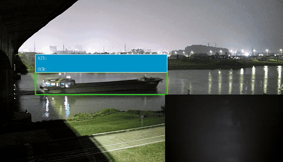
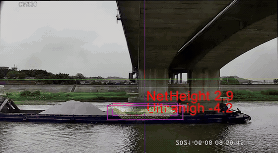
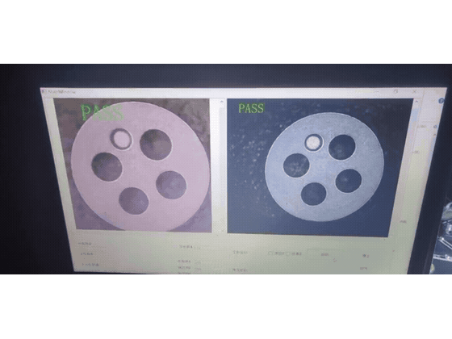
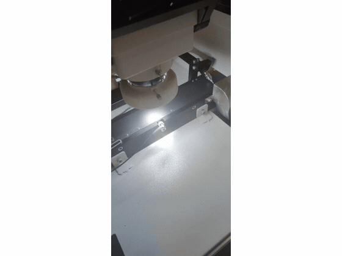
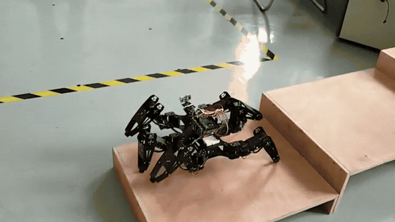

# 黄伟昇 · 项目作品集

**C/C++ · Qt · 嵌入式控制 · 计算机视觉部署 · 工业设备集成**

目前就读于华南师范大学电子信息（仪器仪表工程）硕士专业，具有企业软件研发与嵌入式项目实践经历。这里通过项目介绍与实物演示，说明我如何将设备通信、识别模型、数据处理和控制逻辑接入实际系统。

## 项目导航

| 项目 | 我的主要工作 | 展示形式 |
| --- | --- | --- |
| [船舶流量监测与识别预警](#vessel) | 设备接入、识别模型部署、AIS 解析与关联、抓拍联动 | GIF 预览 + 公开展示视频 |
| [桥梁净空与船舶超高监测](#bridge) | 雷达与水位信息接入、多源关联、告警联动、运维工具 | GIF 预览 + 完整视频 |
| [工业五金缺陷检测](#defect) | 深度学习处理、通信开发、检测与分离设备联动 | 软件界面与设备现场并排演示 |
| [仿生跨障碍六足机器人](#hexapod) | 多舵机协同控制、动作组编排、避障与实机调试 | GIF 预览 + 完整视频 |

> 视频项目仅保留动态预览与完整视频入口，不重复展示静态截图。点击 GIF 或视频链接可打开视频文件页；若没有播放器，可下载播放。

---

## 01 · 船舶流量监测与识别预警

**项目背景：** 面向内河航道监控，将视频识别、AIS 船舶信息和摄像头控制接入监测业务，实现船舶发现、身份关联、抓拍取证与结果输出。该部分属于船舶流量监测预警系统中的视觉与身份信息处理链路。

### 我承担的工作

- **设备接入与数据解析：** 开发 AIS 数据获取与报文解析功能，对接海康、大华摄像头及相关 SDK，将设备数据接入业务处理流程，并通过 MQTT 汇总监测信息供前端展示。
- **识别模型部署与业务集成：** 将 YOLOv5 / OpenVINO 推理流程接入 C++ 业务程序，处理图像预处理、检测框解析与目标信息更新，使识别结果能够驱动后续监控业务。
- **身份信息关联：** 将 AIS 身份信息与视觉检测结果结合，在系统统一坐标尺度下参与多源数据关联；结合卡尔曼滤波与匈牙利匹配组织目标对应关系。
- **摄像头联动与证据输出：** 对接云台控制、抓拍录像及 OCR 信息识别，组织目标图像和识别结果，完成从目标发现到业务结果输出的链路。

**关键技术：** `C++` · `Qt` · `OpenCV` · `YOLOv5 / OpenVINO` · `摄像头 SDK / ONVIF / PTZ` · `AIS / NMEA 0183` · `MQTT` · `卡尔曼滤波 / 匈牙利匹配` · `OCR 对接`

**业务链路：** 设备接入 → 视频识别与 AIS 解析 → 目标关联 → 摄像头联动 / OCR → 监测结果输出。

**完整演示：** [船舶夜间识别与球机抓拍 · 约 46 秒](assets/videos/vessel-night.mp4)

**展示说明：** 本节仅使用已确认可以公开的展示视频；含内部控制台的其他双摄素材不对外发布。

---

## 02 · 桥梁净空与船舶超高监测

**项目背景：** 桥梁防碰撞监测场景下，结合激光雷达、水位和现场视频信息，判断船舶通航风险，并在画面中展示目标框、桥下净空和高度相关信息。本演示展示团队系统的运行效果，与上一项目属于同一航道监测业务的不同模块。

### 我承担的工作

- **异构设备接入：** 处理激光雷达、水位计、AIS、摄像头及 VHF 广播等设备的信息与控制接口，将不同来源的数据接入监测系统。
- **雷达信息与风险业务集成：** 对接 PCL 点云处理链路及目标信息，结合水位数据参与通航风险判断，将监测结果接入摄像头抓拍录像和 VHF 广播告警流程。
- **多源数据关联：** 结合卡尔曼滤波与匈牙利匹配，关联 AIS、摄像头和雷达目标，在统一坐标尺度下组织船舶身份、视觉与尺寸信息。
- **跨平台调试与现场交付：** 基于 Qt 开发适用于 Windows / Linux、x86 / ARM 的运维调试工具，用于设备接入检查、现场部署与问题定位。按简历记录，现场部署调试周期由 3—4 天缩短至约 1 天。

**关键技术：** `C++ / Qt` · `PCL 点云处理链路` · `激光雷达 / 水位计` · `卡尔曼滤波 / 匈牙利匹配` · `MQTT` · `VHF 告警联动` · `Windows / Linux` · `x86 / ARM`

**业务链路：** 雷达 / 水位 / AIS / 视频接入 → 目标信息关联 → 通航风险判断 → 抓拍录像 / 广播告警 → 前端展示。

**完整演示：** [桥梁净空与船舶超高监测 · 约 44 秒](assets/videos/bridge-clearance.mp4)

> 画面中的数值为历史演示数据，不代表检测精度或验收指标。视频展示团队系统效果，个人工作以上述职责说明为准，不表示整套系统或全部点云算法由我独立完成。

---

## 03 · 工业五金缺陷检测与设备联动

**项目背景：** 针对五金工件冲压后可能出现的缺陷，通过视觉检测识别异常工件，将检测结果传递给下位机，配合执行设备完成异常件分离。两段视频分别展示软件检测界面与设备运行现场。

### 我承担的工作

- **深度学习处理与部署：** 负责项目中的深度学习相关处理，将图像识别结果接入检测程序，供后续缺陷判定与设备控制使用。
- **上下位机通信：** 开发检测程序与下位机之间的通信功能，将异常件检测结果转换为设备可使用的控制信息。
- **识别与执行流程对接：** 对接检测结果和分离设备的控制流程，围绕“识别—判定—指令下发—异常件分离”开展软件与实机联调。

**关键技术：** `视觉模型部署` · `图像处理` · `上下位机通信` · `控制指令对接` · `实机联调`

| 软件检测界面 | 设备运行现场 |
| :---: | :---: |
|  |  |
| [观看完整视频 · 约 15 秒](assets/videos/defect-screen.mp4) | [观看完整视频 · 约 14 秒](assets/videos/defect-machine.mp4) |

两列分别展示软件识别结果与设备执行过程。点击动态预览可打开对应视频；两段预览为独立循环，不表示逐帧同步。

---

## 04 · 仿生跨障碍六足机器人

**项目背景：** 本科阶段的嵌入式实践项目。采用仿昆虫六足结构，通过 STM32 控制 18 路舵机，利用动作组描述不同步态与姿态；结合超声波、红外和姿态传感器，为移动和避障提供反馈。

### 我承担的工作

- **多舵机运动控制：** 编写多舵机协同运动控制代码，组织各关节的目标动作，使机器人按照预定步态完成移动与姿态调整。
- **动作组录入与调试：** 录入并调整动作组，通过实机反复协调抬腿、支撑和身体姿态，使动作序列能够在整机上执行。
- **避障与整机联调：** 将传感器反馈接入控制流程，实现避障功能，并调试传感器采集、动作选择和舵机执行之间的配合。

**关键技术：** `STM32` · `C/C++` · `18 路舵机` · `步态与动作组` · `超声波 / 红外 / IMU` · `软硬件联调`

**控制链路：** 传感器采集 → 状态判断 → 动作组选择 → 多舵机协同 → 机器人运动。

**完整演示：** [六足机器人实物演示 · 约 1 分 10 秒](assets/videos/hexapod-robot.mp4)

> 本节重点展示我承担的运动控制、动作组调试与避障工作，不将全部机械结构或硬件设计描述为个人独立成果。

---

## 工程能力与对应实践

| 方向 | 我做过的工作 | 对应项目 |
| --- | --- | --- |
| C++ 业务开发与模型部署 | 设备数据处理、检测结果解析、业务逻辑与输出链路集成 | 船舶监控、工业缺陷检测 |
| 多设备接入与数据关联 | AIS / 雷达 / 水位 / 摄像头接入，多源目标关联、抓拍和广播联动 | 航道与桥区监测 |
| 跨平台运维与现场联调 | Qt 运维工具、Windows / Linux 与 x86 / ARM 适配、部署调试 | 航道监测系统 |
| 嵌入式控制 | STM32、多舵机协同、动作组编排、传感器反馈与避障 | 六足机器人 |

本仓库仅展示项目介绍和演示素材，不包含公司源代码、模型权重、部署配置或个人证明材料。

---

## 作品使用声明

本仓库仅用于黄伟昇的个人求职、项目经历介绍及作品展示，**不是开源项目，不采用 MIT、Apache、GPL 等开放许可证**。

- **权利归属：** 本人拥有权利的原创文字及展示内容，其权利由本人保留。涉及企业项目、团队成果、第三方组件及素材的权利，归相应权利人所有；本人参与项目不表示拥有全部项目成果的权利。
- **使用范围：** 欢迎为招聘评估、了解本人项目经历而在线浏览本作品集。除相关权利人的明确授权、适用法律或 GitHub 平台条款允许的情形外，不得复制转载、修改改编、再分发或用于商业用途，也不得冒充本人或将展示成果作为自己的项目经历。
- **不授予额外许可：** 内容公开可见，或通过 GitHub 查看、Fork、下载获得副本，不代表获得将相关内容用于上述其他用途的许可。本声明不排除 GitHub 平台条款允许的查看与 Fork 等行为，也不取代第三方内容原有的许可条件。
- **授权咨询：** 如需转载或其他使用，请先通过 GitHub 联系本人，并取得相应权利人的明确授权。本声明不构成对企业或第三方内容的再授权。

本声明用于明确展示目的和使用边界，不是技术防下载措施。

更新：2026-10-09 · [目录维护与上传说明](docs/维护与上传.md)
